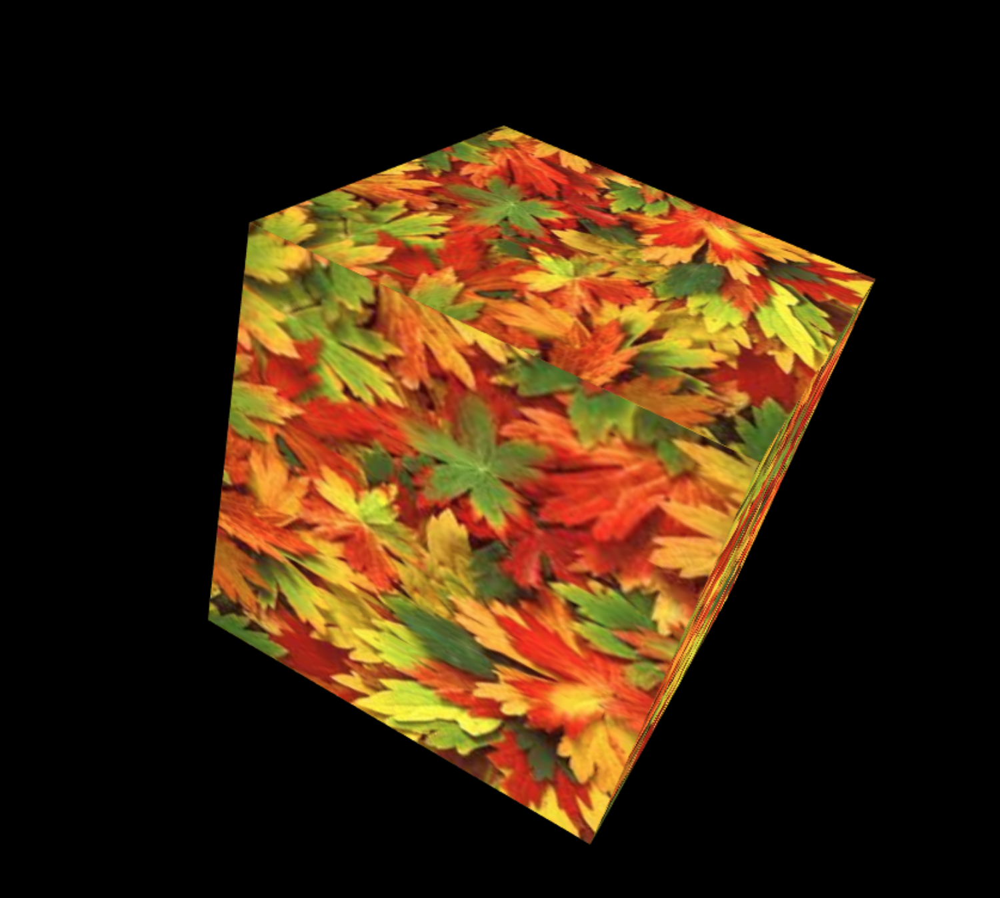
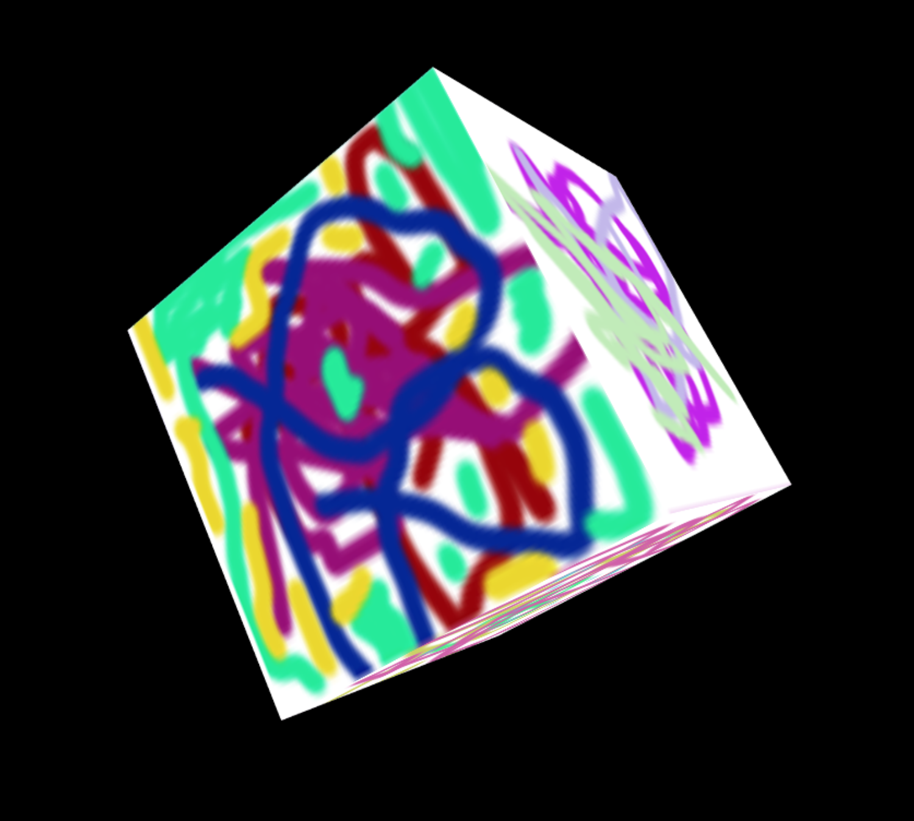
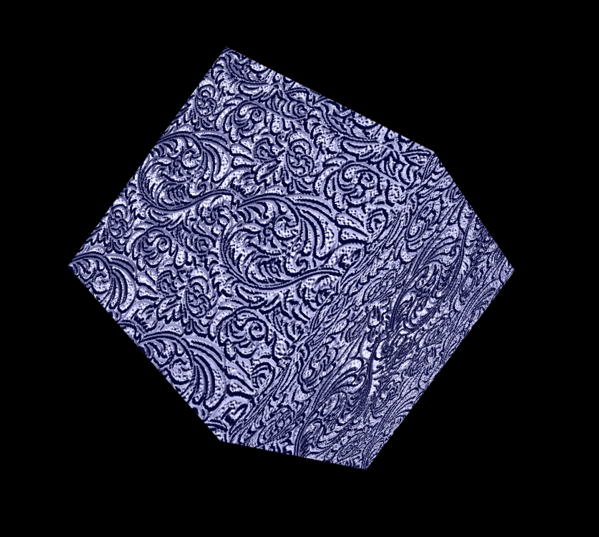

# Textured Cubes #

Examples of different textured surfaces applied to a cube in WEBGL.

* Cube 1: Textured cube: A simple textured surface applied to a cube.
* Cube 2: Multi-textured cube: A multi-textured surface applied to a cube so that each side of the cube displays a different pattern.
* Cube 3: Bump map cube: A bump map applied to a cubed shape.

 

  
  
  

